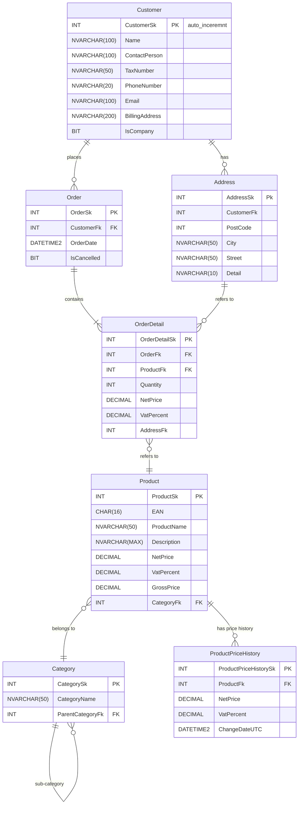
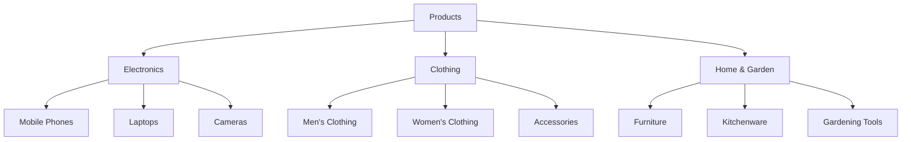

# Database documentation
## Model



## Database table creation code
``` sql
USE webshop;
GO
CREATE TABLE Customer (
    CustomerSk INT IDENTITY(1,1) PRIMARY KEY,
    Name NVARCHAR(100) NOT NULL,
    ContactPerson NVARCHAR(100),
    TaxNumber NVARCHAR(50),
    PhoneNumber NVARCHAR(20),
    Email NVARCHAR(100) NOT NULL UNIQUE,
    BillingAddress NVARCHAR(200) NOT NULL,
    IsCompany BIT
);

CREATE TABLE Category (
    CategorySk INT IDENTITY(1,1) PRIMARY KEY,
    CategoryName NVARCHAR(50) NOT NULL,
    ParentCategoryFk INT NULL REFERENCES Category(CategorySk)
);

CREATE TABLE Product (
    ProductSk INT IDENTITY(1,1) PRIMARY KEY,
    EAN CHAR(16),
    ProductName NVARCHAR(50) NOT NULL,
    Description NVARCHAR(MAX),
    NetPrice DECIMAL(18,2) NOT NULL CHECK (NetPrice >= 0),
    VatPercent INT NOT NULL CHECK (VatPercent BETWEEN 0 AND 100),
    GrossPrice DECIMAL(18,2) NOT NULL CHECK (GrossPrice >= 0),
    Stock INT NOT NULL CHECK (Stock >= 0),
    CategoryFk INT NOT NULL REFERENCES Category(CategorySk)
);

CREATE TABLE ProductPriceHistory (
    ProductPriceHistorySk INT IDENTITY(1,1) PRIMARY KEY,
    ProductFk INT NOT NULL REFERENCES Product(ProductSk),
    NetPrice DECIMAL(18,2) NOT NULL CHECK (NetPrice >= 0),
    VatPercent INT NOT NULL CHECK (VatPercent BETWEEN 0 AND 100),
    ChangeDateUTC DATETIME2 NOT NULL
);

CREATE TABLE Address (
    AddressSk INT IDENTITY(1,1) PRIMARY KEY,
    CustomerFk INT NOT NULL REFERENCES Customer(CustomerSk),
    PostCode INT NOT NULL,
    City NVARCHAR(50) NOT NULL,
    Street NVARCHAR(50) NOT NULL,
    Detail NVARCHAR(10) NOT NULL
);

CREATE TABLE [Order] (
    OrderSk INT IDENTITY(1,1) PRIMARY KEY,
    CustomerFk INT NOT NULL REFERENCES Customer(CustomerSk),
    OrderDate DATETIME2 NOT NULL DEFAULT GETDATE(),
    DiscountPercent INT NOT NULL DEFAULT 0 CHECK (DiscountPercent BETWEEN 0 AND 100),
    TotalAmount DECIMAL(18,2) NULL,
    IsCancelled BIT
);

CREATE TABLE OrderDetail (
    OrderDetailSk INT IDENTITY(1,1) PRIMARY KEY,
    OrderFk INT NOT NULL REFERENCES [Order](OrderSk),
    ProductFk INT NOT NULL REFERENCES Product(ProductSk),
    Quantity INT NOT NULL CHECK (Quantity >= 0),
    NetPrice DECIMAL(18,2) NOT NULL CHECK (NetPrice >= 0),
    VatPercent INT NOT NULL CHECK (VatPercent BETWEEN 0 AND 100),
    AddressFk INT NOT NULL REFERENCES Address(AddressSk)
);
```

## Category hierarchy


